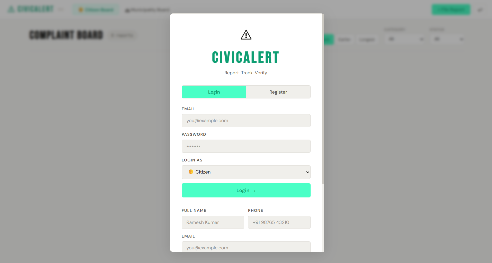
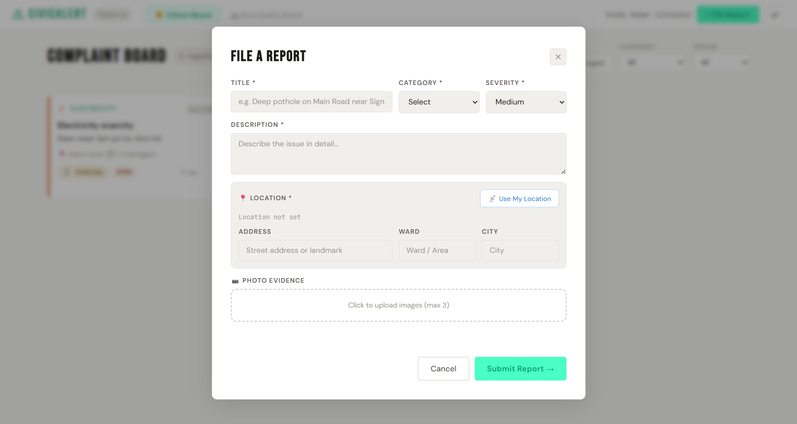
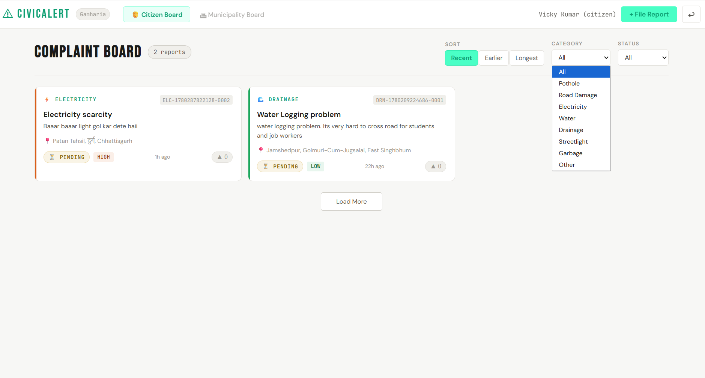
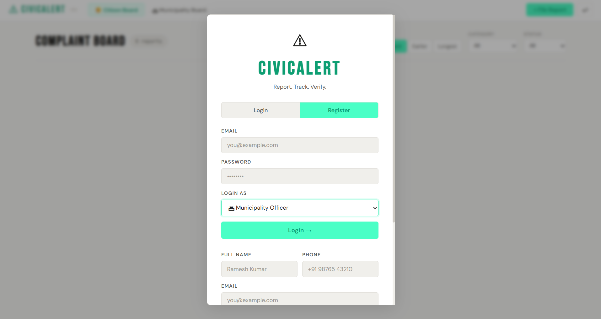

# ⚠️ PrajaVani — Voice of the Citizens

A full-stack civic complaint platform where citizens can report infrastructure issues directly to the municipality — with GPS location, photo evidence, and a unique **Work Verification Voting** system to hold authorities accountable.

> "Praja" means Citizens. "Vani" means Voice. PrajaVani is exactly that. 📢

🌐 **Live Demo:** [praja-vani.vercel.app](https://praja-vani.vercel.app)

---

## ✨ Features

### 👨‍👩‍👧 For Citizens
- 📍 **GPS Auto-Detection** — Auto-fill location using browser geolocation + reverse geocoding
- 📝 **File Complaints** — Title, category, severity, description, address, photo evidence
- 📸 **Photo Upload** — Up to 3 images per complaint as evidence
- 🗳️ **Upvote System** — Upvote complaints to raise their priority
- ✅ **Work Verification Voting** — Vote whether the municipality actually fixed the issue
  - 🟢 Green = majority says work is done
  - 🔴 Red = majority says work is NOT done
- 🔍 **Filter & Sort** — Filter by category, status; sort by recent, earlier, or longest pending

### 🏛️ For Municipality Officers
- 📊 **Municipality Dashboard** — View and manage all complaints
- 🔄 **Update Status** — Mark complaints as Pending / In Progress / Resolved
- 📝 **Add Official Notes** — Add remarks on each complaint
- 🔍 **Filter by Category & Status** — Manage workload efficiently

### 🔐 Authentication
- JWT-based secure login & registration
- Role-based access — **Citizen** and **Municipality Officer**
- Ward/Area based account registration

---

## 📂 Complaint Categories

| Category | Icon | Description |
|----------|------|-------------|
| Pothole | 🕳️ | Road potholes and surface damage |
| Road Damage | 🛣️ | Broken roads, dividers, footpaths |
| Electricity | ⚡ | Power outages, faulty streetlights |
| Water | 💧 | Water shortage, pipe leakage |
| Drainage | 🌊 | Waterlogging, blocked drains |
| Streetlight | 💡 | Non-functioning street lights |
| Garbage | 🗑️ | Waste disposal issues |
| Other | 📌 | Any other civic issue |

---

## 🛠️ Tech Stack

**Frontend**
- Vanilla HTML5, CSS3, JavaScript (ES6+)
- Browser Geolocation API
- OpenStreetMap Nominatim (reverse geocoding)

**Backend**
- Node.js + Express
- MongoDB Atlas + Mongoose
- JWT Authentication
- Multer (image uploads)

**Deployment**
- Frontend → Vercel
- Backend → Render
- Database → MongoDB Atlas

---

## 🚀 Getting Started

### Prerequisites
- Node.js v16+
- MongoDB Atlas account

### 1. Clone the repo
```bash
git clone https://github.com/Vickykumar03/PrajaVani.git
cd PrajaVani
```

### 2. Setup Backend
```bash
cd backend
cp .env.example .env
# Fill in MONGODB_URI and JWT_SECRET
npm install
node server.js
```

### 3. Open Frontend
Just open `frontend/index.html` in your browser, or use Live Server in VS Code.

Make sure the API URL in `frontend/app.js` points to:
```js
const API = 'http://localhost:5000/api'; // for local
```

---

## 📁 Project Structure

```
PrajaVani/
├── backend/
│   ├── middleware/       # Auth middleware
│   ├── models/           # Mongoose schemas (User, Complaint)
│   ├── routes/           # API routes (auth, complaints, municipality)
│   └── server.js         # Express app entry point
│
└── frontend/
    ├── index.html        # Main HTML file
    ├── style.css         # Styles
    └── app.js            # All frontend logic
```

---

## 🔌 API Endpoints

| Method | Endpoint | Description |
|--------|----------|-------------|
| POST | `/api/auth/register` | Register new user |
| POST | `/api/auth/login` | Login user |
| GET | `/api/complaints` | Get all complaints |
| POST | `/api/complaints` | File new complaint |
| PUT | `/api/complaints/:id/status` | Update status (municipality) |
| POST | `/api/complaints/:id/upvote` | Upvote a complaint |
| POST | `/api/complaints/:id/verify` | Vote on work verification |
| GET | `/api/municipality/dashboard` | Municipality dashboard data |
| GET | `/api/health` | Health check |

---

## 🌍 Deployment

### Backend (Render)
1. Create Web Service on [render.com](https://render.com)
2. Root Directory: `backend`
3. Build Command: `npm install`
4. Start Command: `node server.js`
5. Environment Variables:
```
MONGODB_URI   = your atlas connection string
JWT_SECRET    = your secret key
PORT          = 5000
NODE_ENV      = production
```

### Frontend (Vercel)
1. Import repo on [vercel.com](https://vercel.com)
2. Root Directory: `frontend`
3. No build command needed (static site)

---

## 📸 Screenshots

| Login & Register | File a Report |
|-----------------|---------------|
|  |  |

| Complaint Board | Categories |
|----------------|------------|
|  |  |

---

## 📄 License

MIT License — feel free to use and modify.

---

Made with ❤️ by [Vicky Kumar](https://github.com/Vickykumar03)
